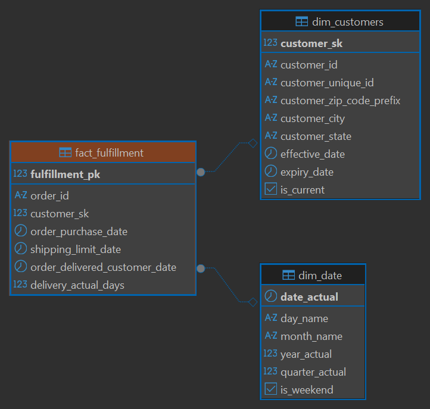
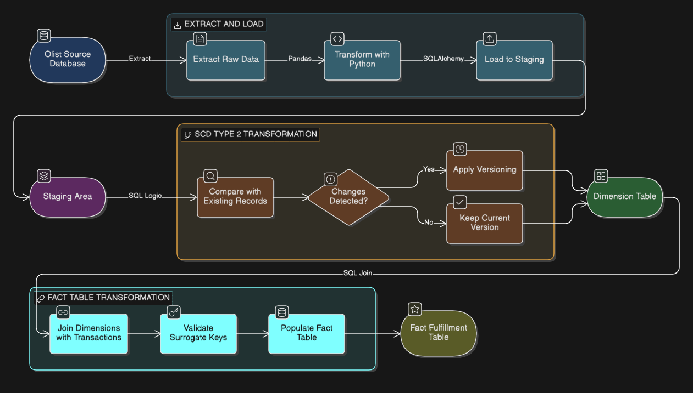

# UPDATE (FOR EXERCISE WEEK 6-DATA WAREHOUSE PACMAAN)
--------
📊 Data Warehouse Implementation & ELT Pipeline Report

Case Study: Olist E-Commerce Dataset

🕵️ Step #1 - Requirements Gathering

During the initial phase, a simulated meeting was held with stakeholders from the Olist Logistics and Marketing teams to identify business requirements for historical data. The following key points define the data strategy:

Question: Do we need to store the history of customer addresses if they move, or is simply updating them enough?

Answer: We must store the history. The Logistics team needs to analyze whether shipping performance changes when a customer changes their domicile.

Question: How does an address change affect transaction data (orders) that occurred in the past?

Answer: Past orders must remain linked to the address at the time the order was placed. Only new orders will use the new address to ensure annual reports remain consistent.

Question: How often will this data be updated from the operational system?
Answer: A daily batch update is sufficient for internal reporting and courier performance analysis.

Question: What additional information is needed to facilitate data version tracking?

Answer: We need clear indicators for the active record (is_current) and the address validity period (effective_date & expiry_date).
--------
🛠️ Step #2 - Slowly Changing Dimension (SCD) Strategy
Based on the requirements above, I decided to implement SCD Type 2.
Why SCD Type 2?

History Preservation: It allows us to track every change in customer location without deleting or overwriting old data.

Report Integrity: It ensures that past shipping analysis remains accurate according to the customer's location at the time of the transaction.

New ERD Design:
The dim_customers table has been modified by adding a Surrogate Key (customer_sk) as the Primary Key, replacing the Natural Key (customer_id) to support storing multiple data versions for the same customer.

New Entity-Relationship Diagram (ERD): 
Below is the implemented Star Schema design, featuring the addition of a Surrogate Key (customer_sk) and control columns (effective_date, expiry_date, and is_current) to support historical data tracking:


---------
🚀 Step #3 - ELT with Python & SQL
The ELT (Extract, Load, Transform) process was built to move data from the operational database to the data warehouse automatically, cleanly, and structurally.

Workflow Description: 

The following diagram illustrates the automated ELT pipeline, showing the data flow from the source database to the finalized Data Warehouse layers:


Workflow Description:
Extract & Load: Using Python (pandas) to pull raw data from the source and SQLAlchemy to load it into the Staging schema.

Transformation (SCD 2): Using SQL logic to detect changes. If a difference in city or state is found, the system automatically updates the status of the old record to expired and inserts the new record as the active version.

Fact Table Loading: Building the fact_fulfillment table by joining transaction data with the dimension table using Surrogate Keys.

Error Handling & Alert:

The Python script is equipped with try-except blocks to catch connection failures or query errors. If an error occurs, the system provides an Alert in the form of a log message in the terminal to facilitate the debugging process.
--------
🎼 Step #4 - Orchestration with Luigi
The entire workflow is managed using the Luigi framework to handle task dependencies automatically.

Task Dependency: Luigi ensures that data transformation (Step 3) only runs if the DWH schema construction (Step 2) has been successfully completed.

Automated Retries: Ensures that failed processes can be clearly identified through status logs and can be restarted from the point of failure.

Scheduling (Cron):
For production server automation, this pipeline can be scheduled using a Cron Job to run regularly (e.g., every midnight):
```
0 0 * * * cd /project-path && python orchestrator.py
```
---------
✅ Step #5 - Final Results & Validation
The project has been successfully executed and validated with the following results:

History Tracking: The system successfully identified and recorded customer city change history. There were 148 rows of historical data successfully captured during the testing process.

Note: Raw CSV datasets are not included in this repository due to GitHub's file size limits. Please ensure the Olist dataset is placed in the root directory before running the pipeline.

# Docker Compose Setup for Project
Before you can run this project using Docker Compose, make sure you have created a `.env` file with the necessary environment variables. 

Here are the steps to set up the project:
Note : **Make Sure Your /helper/source/init.sql have the data**
1. Clone repository
2. If you can't find data dataset-olist/helper/source_init/init.sql, please download manually https://github.com/Kurikulum-Sekolah-Pacmann/dataset-olist/tree/main/helper/source_init
1. Create a new file named `.env` in the root directory of the project.
2. Open the `.env` file and add the following environment variables:

```
# Source
SRC_POSTGRES_DB=olist-src
SRC_POSTGRES_HOST=localhost
SRC_POSTGRES_USER=postgres
SRC_POSTGRES_PASSWORD=[YOUR PASSWORD]
SRC_POSTGRES_PORT=[YOUR PORT]

# DWH
DWH_POSTGRES_DB=olist-dwh
DWH_POSTGRES_HOST=localhost
DWH_POSTGRES_USER=postgres
DWH_POSTGRES_PASSWORD=[YOUR PASSWORD]
DWH_POSTGRES_PORT=[YOUR PORT]

```

Now you are ready to run the project using Docker Compose. Use the following command in the terminal:

```
docker-compose up -d
```

This will start the project and all its dependencies defined in the `docker-compose.yml` file.

Data Integrity: The fact table successfully links to the correct Surrogate Key in the dimension table, ensuring there are zero orphan records.
